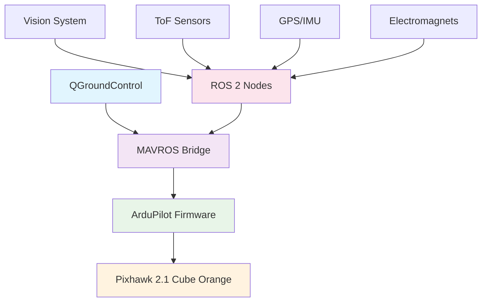

<div align="center">


# KAERTEI 2025 FAIO Drone System

### *Fully Autonomous Indoor-Outdoor Competition Ready*

[](https://docs.ros.org/en/humble/)
[](https://ardupilot.org/)
[](https://python.org/)
[](LICENSE)


*Powered by ROS 2 Humble Hawksbill*

</div>

---

## Deskripsi

Sistem drone VTOL autonomous yang komprehensif dan siap kompetisi untuk KAERTEI 2025 Divisi Fully Autonomous Indoor-Outdoor (FAIO). Dibangun dengan teknologi terdepan dan arsitektur yang robust untuk menjamin performa maksimal.

### Tech Stack Unggulan
- **Hardware**: Pixhawk 2.1 Cube Orange (Industrial Grade)
- **Firmware**: ArduPilot (Proven & Reliable)  
- **Communication**: MAVROS Bridge ke ROS 2
- **GCS**: QGroundControl (Professional Mission Planning)

---

## Arsitektur Sistem

<div align="center">



</div>

### Hardware Konfigurasi Elite

| Komponen | Spesifikasi | Fungsi |
|----------|-------------|---------|
| **Drone Platform** | Hexacopter VTOL | Stabilitas & Redundancy |
| **Flight Controller** | Pixhawk 2.1 Cube Orange | Kontrol penerbangan presisi |
| **Vision System** | 3x Kamera (Depan/Belakang/Atas) | Computer vision & navigasi |
| **Distance Sensors** | 3x ToF (Kiri/Kanan/Depan) | Obstacle avoidance |
| **Actuators** | 2x Electromagnet + Relay | Pickup & drop mechanism |
| **Navigation** | GPS + IMU + Compass | Positioning & orientation |
| **Power System** | 4S LiPo dengan monitoring | Extended flight time |

### Software Stack

<div align="center">

```ascii
┌─────────────────────────────────────────┐
│     Mission Control (Python)           │ ← Your Application Layer
├─────────────────────────────────────────┤
│        ROS 2 Nodes Network             │ ← Intelligent Coordination  
├─────────────────────────────────────────┤
│           MAVROS Bridge                │ ← Protocol Translation
├─────────────────────────────────────────┤
│        ArduPilot Firmware              │ ← Flight Control Logic
├─────────────────────────────────────────┤
│      Pixhawk 2.1 Cube Orange           │ ← Hardware Abstraction
└─────────────────────────────────────────┘
```

</div>

---

## Node Architecture

<div align="center">

### Core Mission Intelligence
```
┌─────────────────────────────────────┐
│        mission_node.py              │
│     (Finite State Machine)         │
│   ┌─────────────────────────────┐   │
│   │ 22 States Mission Flow      │   │
│   │ • Indoor → Outdoor phases   │   │
│   │ • Intelligent decision      │   │
│   │ • Safety monitoring         │   │
│   └─────────────────────────────┘   │
└─────────────────────────────────────┘
```

</div>

### Vision System Modules

| Node | Teknologi | Fungsi Spesifik |
|------|-----------|-----------------|
| `vision_detector_node.py` | **YOLOv8** | Multi-camera object detection |
| `exit_detector.py` | **OpenCV** | Exit gate detection (top camera) |
| `dropzone_detector.py` | **Computer Vision** | Basket detection (indoor/outdoor) |

### Navigation & Control Suite

| Node | Capability | Advanced Features |
|------|------------|-------------------|
| `sensor_monitor.py` | **ToF Integration** | Real-time obstacle avoidance |
| `kalibrasi_navigator.py` | **Auto-centering** | Drift correction algorithm |
| `gps_monitor.py` | **GPS Analytics** | Movement detection & quality |
| `waypoint_controller.py` | **Path Planning** | Outdoor waypoint navigation |
| `flight_mode_switcher.py` | **MAVROS Control** | ArduPilot mode management |

### Hardware Interface Layer

| Node | Hardware Control | Safety Features |
|------|------------------|-----------------|
| `magnet_control.py` | **Electromagnetic Relays** | Auto-release on disarm |

---

## Mission Flow Diagram

<div align="center">


</div>

### Indoor Phase (Precision Navigation)

| Step | Action | Technology Used | Duration |
|------|--------|-----------------|----------|
| 1 | **Takeoff** | MAVROS GUIDED mode → 1.5m | ~30s |
| 2 | **Search Item 1** | Front camera + YOLOv8 | ~60s |
| 3 | **Pickup Item 1** | Visual alignment + Magnet | ~20s |
| 4 | **Search Item 2** | Back camera + YOLOv8 | ~60s |
| 5 | **Pickup Item 2** | Visual alignment + Magnet | ~20s |
| 6 | **Navigate Turn** | ToF sensor-based turn detection | ~30s |
| 7 | **Search Dropzone** | Front camera + basket detection | ~45s |
| 8 | **Drop Items** | Sequential electromagnet release | ~15s |
| 9 | **Find Exit** | Top camera + gate detection | ~30s |
| 10 | **Exit Indoor** | Transition to outdoor zone | ~20s |

### Outdoor Phase (GPS Navigation)

| Step | Action | Technology Used | Distance |
|------|--------|-----------------|----------|
| 1 | **GPS Mission** | ArduPilot AUTO mode | ~30m |
| 2 | **GPS Fallback** | GUIDED + dead reckoning (if needed) | Variable |
| 3 | **Pickup Outdoor** | YOLOv8 + magnet system | Target zone |
| 4 | **Return Mission** | GPS waypoint navigation | ~100m |
| 5 | **Hover Search** | 97m threshold + vision search | ~3m radius |
| 6 | **Drop Outdoor** | Electromagnet release | Target zone |
| 7 | **Landing** | ArduPilot LAND mode | Landing pad |

---

## Flight Modes (ArduPilot Integration)

<div align="center">

| Mode | Purpose | Usage | Safety Level |
|------|---------|-------|--------------|
| **GUIDED** | Manual ROS 2 setpoints | Indoor precision | High |
| **AUTO** | GPS mission waypoints | Outdoor navigation | High |
| **LAND** | Autonomous landing | Mission completion | Medium |
| **STABILIZE** | Manual emergency control | Emergency only | Manual |

</div>

---

## Topic Architecture

### Command & Control Topics

<div align="center">

```
Mission Intelligence
├── /mission/state              → Current FSM state
├── /mission/command            → Mission commands  
├── /mavros/set_mode            → ArduPilot mode control
└── /mavros/cmd/arming          → Arm/disarm commands
```

</div>

### Vision & Detection Topics

<div align="center">

```
Computer Vision
├── /vision/camera_enable       → Enable specific camera
├── /vision/detection           → YOLOv8 detection results
├── /vision/exit_detected       → Exit gate detection
└── /vision/{camera}/image      → Real-time image streams
    ├── /vision/front/image     → Front camera feed
    ├── /vision/back/image      → Back camera feed
    └── /vision/top/image       → Top camera feed
```

</div>

### Navigation & Sensor Topics

<div align="center">

```
Navigation System
├── /sensors/status            → ToF sensor readings
├── /gps/moving_status         → GPS movement detection
├── /waypoint/distance         → Distance to target waypoint
└── /mavros/global_position/*  → GPS data from MAVROS
    ├── /mavros/global_position/global → Current GPS position
    └── /mavros/global_position/rel_alt → Relative altitude
```

</div>

### Hardware Control Topics

<div align="center">

```
Hardware Interface
├── /hardware/magnet_control   → Electromagnet service
├── /mavros/setpoint_position/* → Position control
└── /mavros/setpoint_velocity/* → Velocity control
    ├── /mavros/setpoint_position/local → Local position setpoints
    └── /mavros/setpoint_velocity/cmd_vel → Velocity commands
```

</div>

---

## Installation & Setup

### Prerequisites

<div align="center">

| Component | Version | Installation Command |
|-----------|---------|---------------------|
| **ROS 2** | Humble | `sudo apt install ros-humble-desktop` |
| **MAVROS** | Latest | `sudo apt install ros-humble-mavros*` |
| **Python** | 3.8+ | Pre-installed with ROS 2 |
| **OpenCV** | 4.5+ | `pip3 install opencv-python` |
| **YOLOv8** | Latest | `pip3 install ultralytics` |

</div>

### Quick Setup (Automated)

```bash
# Clone repository
git clone https://github.com/your-username/kaertei-2025-faio.git
cd kaertei-2025-faio

# Run automated setup
chmod +x src/drone_mvp/setup.sh
./src/drone_mvp/setup.sh

# Build workspace
colcon build --packages-select drone_mvp
source install/setup.bash
```

### Launch Options

<div align="center">

#### **Recommended: All-in-One Manager**
```bash
./src/drone_mvp/drone_manager.sh mission --camera front
```

#### **Direct Launch**
```bash
ros2 launch drone_mvp drone.launch.py
```

#### **Custom FCU Connection**
```bash
ros2 launch drone_mvp drone.launch.py fcu_url:="serial:///dev/ttyACM0:115200"
```

</div>

---

## Configuration

### MAVROS Connection Settings

Edit `config/mavros_config.yaml`:
```yaml
# Flight Controller Connection
fcu_url: "serial:///dev/ttyUSB0:57600"  # Adjust for your Pixhawk
gcs_url: "udp://@127.0.0.1:14550"      # QGroundControl connection

# System Identification  
system_id: 1
component_id: 1
target_system_id: 1
target_component_id: 1

# Safety Parameters
enable_heartbeat: true
timeout_heartbeat: 5.0
```

### Mission Parameters

Edit `config/competition_config.yaml`:
```yaml
# Indoor Mission Settings
mission:
  indoor_altitude: 1.5          # Meters
  outdoor_altitude: 3.0         # Meters
  mission_timeout: 900          # 15 minutes total

# Sensor Thresholds
sensors:
  tof:
    max_range: 4.0              # ToF sensor range
    detection_threshold: 1.5    # Obstacle detection
    
# GPS Waypoints (UPDATE FOR YOUR VENUE!)
waypoints:
  outdoor_pickup: 
    latitude: -6.365000         # Set actual coordinates
    longitude: 106.825000       # Set actual coordinates
    altitude: 30.0              # Meters above home
    
  outdoor_drop:
    latitude: -6.364500         # Set actual coordinates  
    longitude: 106.825500       # Set actual coordinates
    altitude: 30.0              # Meters above home
```

---

## 📊 **Monitoring & Debugging**

### 🖥️ **Real-time System Monitor**

<div align="center">

```bash
# 🎯 Launch comprehensive monitoring dashboard
./src/drone_mvp/drone_manager.sh monitor
```

**Features:**
- ✅ Live MAVROS connection status
- ✅ GPS fix quality & position  
- ✅ Mission state & progress
- ✅ Vision detection results
- ✅ Sensor readings (ToF)
- ✅ Hardware status (magnets)
- ✅ Flight position & velocity

</div>

### 🔧 **Development Tools**

| Tool | Command | Purpose |
|------|---------|---------|
| 🧪 **Hardware Test** | `./drone_manager.sh calibrate` | Test all hardware components |
| 🎮 **Mission Simulator** | `./drone_manager.sh simulate` | Test mission logic (no hardware) |
| 📡 **MAVROS Test** | `./drone_manager.sh test-mavros` | Test flight controller connection |
| 📊 **System Status** | `./drone_manager.sh status` | Quick system health check |

### 🔍 **Manual Monitoring Commands**

```bash
# 🎯 Mission State
ros2 topic echo /mission/state

# 📡 MAVROS Connection  
ros2 topic echo /mavros/state

# 🛰️ GPS Status
ros2 topic echo /mavros/global_position/global

# 📏 Sensor Readings
ros2 topic echo /sensors/status

# 👁️ Vision Detections
ros2 topic echo /vision/detection
```

---

## 🛡️ **Safety Features**

<div align="center">

### 🚨 **Emergency Procedures**

| Emergency | Command | Description |
|-----------|---------|-------------|
| 🛑 **Emergency Stop** | `./drone_manager.sh emergency` | Immediate system shutdown |
| 🏁 **Emergency Land** | `ros2 topic pub /mission/command std_msgs/String "data: 'EMERGENCY_LAND'"` | Force landing |
| 🎮 **Manual Control** | Switch to **STABILIZE** in QGroundControl | Human takeover |

</div>

### ⚠️ **Autonomous Failsafe System**

| Condition | Response | Backup Action |
|-----------|----------|---------------|
| 🛰️ **GPS Loss** | Dead reckoning navigation | Continue with IMU |
| 📡 **MAVROS Disconnect** | Mission pause | Wait for reconnection |
| 👁️ **Vision Timeout** | Continue with time limits | Use last known position |
| 🔋 **Low Battery** | Return to land immediately | Force landing |
| 🧲 **Magnet Failure** | Auto-release all magnets | Continue mission |

### 🔐 **Built-in Safety Limits**

```yaml
# ⛔ Hard Safety Limits (Non-configurable)
safety:
  max_altitude: 10.0      # Maximum flight height
  max_velocity: 5.0       # Maximum speed
  geofence_enabled: true  # Automatic boundary enforcement
  battery_failsafe: 15%   # Critical battery level
```

---

## 🏆 **Competition Compliance**

<div align="center">

### ✅ **KAERTEI 2025 FAIO Requirements**

| Requirement | Status | Implementation |
|-------------|--------|----------------|
| 🤖 **Fully Autonomous** | ✅ **COMPLETE** | Zero human intervention |
| 🏠➡️🌍 **Indoor-Outdoor** | ✅ **COMPLETE** | Seamless phase transition |
| 📦 **Object Pickup** | ✅ **COMPLETE** | Electromagnetic system |
| 🎯 **Precision Drop** | ✅ **COMPLETE** | Vision-guided targeting |
| 🛰️ **GPS Navigation** | ✅ **COMPLETE** | Waypoint-based flight |
| 👁️ **Computer Vision** | ✅ **COMPLETE** | YOLOv8 + OpenCV |
| 🧠 **Real-time AI** | ✅ **COMPLETE** | ROS 2 FSM system |
| 🛡️ **Safety Systems** | ✅ **COMPLETE** | Multi-layer failsafes |

</div>

### 🎯 **Hardware Validation**

<div align="center">

| Component | Requirement | Our Implementation |
|-----------|-------------|-------------------|
| 🎛️ **Flight Controller** | ArduPilot Compatible | ✅ Pixhawk 2.1 Cube Orange |
| 👁️ **Vision System** | Multi-camera | ✅ 3x Camera array (Front/Back/Top) |
| 📏 **Sensors** | Distance measurement | ✅ 3x ToF sensors + GPS + IMU |
| 🧲 **Manipulation** | Object pickup | ✅ Dual electromagnet system |
| 📡 **Communication** | Real-time telemetry | ✅ MAVROS + QGroundControl |

</div>

---

## 🔧 **Troubleshooting Guide**

<div align="center">

### 🚨 **Common Issues & Solutions**

</div>

| Issue | Symptoms | Solution |
|-------|----------|----------|
| 📡 **MAVROS Not Connecting** | No `/mavros/state` topic | `./drone_manager.sh test-mavros` |
| 🛰️ **GPS Not Working** | Poor fix quality | Check antenna placement & wait outdoors |
| 👁️ **Vision Detection Failing** | No detections | Test cameras: `v4l2-ctl --list-devices` |
| ⚡ **Hardware Not Responding** | Component failures | Run: `./drone_manager.sh calibrate` |
| 🔋 **Power Issues** | Unexpected shutdowns | Check battery voltage & connections |

### 📡 **MAVROS Connection Debug**

```bash
# Check USB devices
ls /dev/ttyUSB* /dev/ttyACM*

# Fix permissions  
sudo chmod 666 /dev/ttyUSB0

# Test connection
ros2 topic echo /mavros/state --once

# Manual MAVROS launch
ros2 launch mavros apm.launch.py fcu_url:="serial:///dev/ttyUSB0:57600"
```

### GPS Troubleshooting

```bash
# Check GPS status
ros2 topic echo /mavros/global_position/global

# Monitor GPS quality
ros2 topic echo /mavros/gpsstatus/gps1/raw

# Check satellite count
rostopic echo /mavros/global_position/compass_hdg
```

### Vision System Debug

```bash
# List available cameras
v4l2-ctl --list-devices

# Test individual camera
ros2 run drone_mvp vision_detector_node.py --camera front

# Check YOLOv8 model
python3 -c "from ultralytics import YOLO; YOLO('yolov8n.pt')"
```

---

## Support & Development

<div align="center">

### Team Structure

| Role | Responsibility | Contact |
|------|---------------|---------|
| **Mission Lead** | System integration & mission logic | mission@team.com |
| **Flight Control** | ArduPilot & MAVROS integration | flight@team.com |
| **Vision Engineer** | Computer vision & AI systems | vision@team.com |
| **Hardware Lead** | Electronics & mechanical systems | hardware@team.com |

</div>

### Development Guidelines

```bash
# Always test in simulation first
./drone_manager.sh simulate

# Run hardware validation before flights  
./drone_manager.sh calibrate

# Monitor system during development
./drone_manager.sh monitor
```

### Additional Resources

- **ArduPilot Documentation**: https://ardupilot.org/copter/
- **ROS 2 Humble Docs**: https://docs.ros.org/en/humble/
- **MAVROS Wiki**: http://wiki.ros.org/mavros
- **YOLOv8 Guide**: https://docs.ultralytics.com/

---

<div align="center">

## Ready for KAERTEI 2025 Competition!


### Launch Commands

```bash
# Full system check
./drone_manager.sh calibrate

# Start mission  
./drone_manager.sh mission --camera front

# Monitor system
./drone_manager.sh monitor
```

---

**Built with passion for autonomous flight**

**KAERTEI 2025 FAIO Division**

*Last updated: August 2025*

</div>
