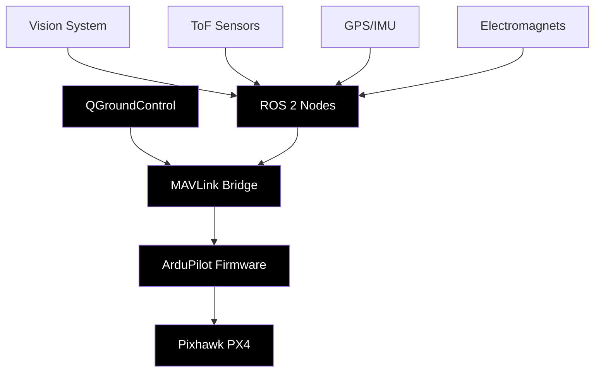

<div align="center">


# KAERTEI 2025 FAIO Drone System

### *Ubuntu 22.04 LTS - Zero to Competition Ready*

[](https://docs.ros.org/en/humble/)
[](https://ubuntu.com/)
[](https://ardupilot.org/)
[](https://python.org/)
[](LICENSE)


*Optimized for Ubuntu 22.04 LTS + ROS 2 Humble*

</div>

---

## 📝 Deskripsi

Sistem drone hexacopter autonomous yang komprehensif dan siap kompetisi untuk KAERTEI 2025 Divisi Fully Autonomous Indoor-Outdoor (FAIO). **Dioptimalkan khusus untuk Ubuntu 22.04 LTS** dengan setup otomatis dari nol hingga siap kompetisi dalam 3 langkah sederhana.

### 🎯 Features Utama
- **✅ Ubuntu 22.04 Optimized**: Instalasi otomatis ROS 2 Humble + MAVROS
- **✅ Zero to Competition**: 3 langkah setup dari sistem kosong hingga siap lomba
- **✅ 26 Checkpoint System**: Sistem debug lengkap dengan validasi otomatis
- **✅ Just Command Runner**: Interface sederhana untuk semua operasi
- **✅ Hardware Integration**: Auto-detection Pixhawk, kamera, sensor
- **✅ Vision System**: YOLOv8 + OpenCV multi-camera processing

### 🔧 Tech Stack Unggulan
- **Platform**: Ubuntu 22.04 LTS (Jammy Jellyfish)
- **ROS**: ROS 2 Humble Hawksbill (Long Term Support)
- **Hardware**: Pixhawk PX4/ArduPilot 4.4+
- **Communication**: MAVROS + Direct MAVLink
- **Computer Vision**: OpenCV 4.5+ + YOLOv8 + PyTorch
- **Languages**: Python 3.10 + C++ (ROS 2 nodes)
- **Sensors**: GPS, IMU, ToF, 3x Camera modules
- **Control**: Electromagnet system + RC override

---

## 🚀 Quick Start

**KAERTEI 2025 dioptimalkan untuk Ubuntu 22.04 LTS** dengan sistem setup otomatis:

### ⚡ **Zero to Competition Ready (3 Steps)**
```bash
# Step 1: Complete Ubuntu 22.04 Setup (One Command)
./setup_ubuntu22.sh         # Auto-install ROS 2, MAVROS, dependencies

# Step 2: Verify System Ready
just test-all               # Comprehensive system validation

# Step 3: Run Competition Mission
just mission-debug          # Start 26-checkpoint debug mission
```

### 🎯 **Essential Just Commands**
```bash
# 🏆 COMPETITION COMMANDS
just setup-full             # Complete Ubuntu 22.04 setup
just mission-debug          # Debug mode (step-by-step)
just mission-auto           # Autonomous competition mode
just mission-direct         # Direct Python execution (fastest)

# 🧪 TESTING & VALIDATION
just test-all               # Complete system validation
just validate-checkpoints   # Verify all 26 checkpoints
just doctor                 # System diagnosis
just status                 # System overview

# 🔧 HARDWARE & TROUBLESHOOTING
just fix-permissions        # Fix USB/hardware permissions
just emergency-reset        # Competition day emergency reset
just check-ubuntu          # Verify Ubuntu 22.04

# 📚 HELP & INFORMATION
just help                   # Detailed command reference
just checklist             # Competition readiness checklist
just info                  # System information
```

### 🏃‍♂️ **Competition Workflow**
| Stage | Command | Purpose |
|-------|---------|---------|
| **Setup** | `just setup-full` | Install ROS 2 + MAVROS + dependencies |
| **Validate** | `just test-all` | Verify all systems ready |
| **Practice** | `just mission-debug` | Practice with 26-checkpoint system |
| **Compete** | `just mission-auto` | Full autonomous competition mode |
| **Emergency** | `just emergency-reset` | Competition day troubleshooting |

---

## 🛠️ Ubuntu 22.04 Setup Details
just status                 # Show system status
just info                   # Show system information
just help                   # Quick help guide
```

### 🐧 **Traditional Setup Options**

#### 1. Ubuntu Native (Recommended)
```bash
just setup-ubuntu           # Automated Ubuntu setup
just mission-debug          # Run debug mission
```

#### 2. Docker Container (Universal)
```bash
just docker-build           # Build Docker image
just docker-run             # Run interactive container
```

#### 3. Manual Setup (Advanced)
```bash
cd ros2_ws/src/drone_mvp
./setup.sh ubuntu
./kaertei_master.sh setup
```

---

---

## ⚡ Just Command Runner

KAERTEI 2025 menggunakan **Just** untuk mempermudah command management. Just is a handy way to save and run project-specific commands.

### 📦 Installation
```bash
# Install Just
curl --proto '=https' --tlsv1.2 -sSf https://just.systems/install.sh | bash -s -- --to ~/bin

# Add to PATH (add to ~/.bashrc or ~/.profile)
export PATH="$HOME/bin:$PATH"
```

### 🎯 Essential Commands

<div align="center">

| Command | Description | Environment |
|---------|-------------|-------------|
| `just help` | Show quick help guide | Any |
| `just setup-ubuntu` | Setup Ubuntu dependencies | Native |
| `just docker-build` | Build Docker image | Docker |
| `just mission-debug` | Debug mode (step-by-step) | Native |
| `just mission-auto` | Auto mode (autonomous) | Native |
| `just mission-debug-docker` | Debug mode in Docker | Docker |
| `just mission-auto-docker` | Auto mode in Docker | Docker |
| `just test-all` | Run comprehensive tests | Any |
| `just status` | Show system status | Any |
| `just clean-workspace` | Clean build artifacts | Any |

</div>

### 🔧 Development Commands

<div align="center">

| Command | Description |
|---------|-------------|
| `just check-config` | Verify hardware configuration |
| `just calibrate` | Run hardware calibration |
| `just simulate` | Run mission simulation |
| `just test-deps` | Test system dependencies |
| `just docker-clean` | Clean Docker resources |
| `just backup` | Backup configurations |
| `just update` | Update system & dependencies |

</div>

### 💡 Usage Examples

```bash
# Complete workflow
cd ros2_ws/src/drone_mvp
just setup-ubuntu              # One-time setup
just docker-build              # Build environment  
just mission-debug-docker      # Test in debug mode
just mission-auto-docker       # Run autonomous mission

# Development cycle
just test-all                   # Verify system
just check-config              # Check hardware
just clean-workspace           # Clean builds
just status                    # Monitor system

# Quick help
just --list                    # Show all commands
just help                      # Essential commands guide
just info                      # System information
```

## 🛠️ Tutorial Setup Lengkap

### 📋 Prasyarat Umum

Sebelum memulai, pastikan sistem Anda memiliki:
- **Hardware**: CPU dual-core+, RAM 4GB+, Storage 20GB+
- **Network**: Koneksi internet stabil untuk download dependencies
- **User privileges**: Sudo access untuk instalasi system packages

---

### 🐧 Ubuntu Native Setup (Recommended)

**Tested on: Ubuntu 20.04 LTS, 22.04 LTS**

#### Step 1: Clone Repository
```bash
git clone https://github.com/Vanszs/Dirgagah-KAERTEI.git
cd Dirgagah-KAERTEI/ros2_ws/src/drone_mvp
```

#### Step 2: Automated Setup
```bash
# Setup system dependencies & ROS 2 Humble
./setup.sh ubuntu

# Setup drone system
./kaertei_master.sh setup

# Verify installation
./kaertei_master.sh status
```

#### Step 3: Hardware Connection
```bash
# Connect Pixhawk via USB/Serial
# Default: /dev/ttyUSB0 atau /dev/ttyACM0

# Test MAVROS connection
./kaertei_master.sh test mavros

# Calibrate hardware (if needed)
./kaertei_master.sh calibrate
```

#### Step 4: Run Mission
```bash
# Using Just (Recommended)
just mission-debug          # Debug mode (step-by-step)
just mission-auto           # Auto mode (full autonomous)

# Traditional method
./run_checkpoint_mission.sh debug
./run_checkpoint_mission.sh auto
```

---

### 🐳 Docker Container Setup (Universal)

**Compatible: Any Linux with Docker, Windows WSL2, macOS**

#### Step 1: Install Docker
```bash
# Ubuntu/Debian
sudo apt update && sudo apt install docker.io docker-compose

# Arch Linux
sudo pacman -S docker docker-compose

# Start Docker service
sudo systemctl start docker
sudo systemctl enable docker
```

#### Step 2: Clone & Build
```bash
git clone https://github.com/Vanszs/Dirgagah-KAERTEI.git
cd Dirgagah-KAERTEI/ros2_ws/src/drone_mvp

# Build Docker image
./docker_runner.sh build
```

#### Step 3: Run Container
```bash
# Using Just (Recommended)
just docker-run             # Interactive mode with hardware access

# Inside container, choose one:
just mission-debug-docker   # Debug mode
just mission-auto-docker    # Auto mode

# Traditional method
./docker_runner.sh run
# Inside container:
source /opt/ros/humble/setup.bash
./kaertei_master.sh setup
./run_checkpoint_mission.sh debug
```

#### Docker Advantages:
- ✅ **Isolated environment** - No system pollution
- ✅ **Consistent behavior** - Same across all platforms
- ✅ **Easy cleanup** - Remove container when done
- ✅ **Hardware passthrough** - Full device access

---

### 🏴‍☠️ Arch Linux Setup (Unstable/Experimental)

**⚠️ Warning: Experimental support. May require manual fixes.**

#### Step 1: Base System
```bash
# Update system
sudo pacman -Syu

# Install base dependencies
sudo pacman -S base-devel git python python-pip

# Clone repository
git clone https://github.com/Vanszs/Dirgagah-KAERTEI.git
cd Dirgagah-KAERTEI/ros2_ws/src/drone_mvp
```

#### Step 2: ROS 2 Installation
```bash
# Automated Arch setup (experimental)
./setup.sh arch

# Or manual AUR installation:
# yay -S ros2-humble-desktop
```

#### Step 3: Package Dependencies
```bash
# Install Python packages
pip install -r requirements.txt

# Install additional Arch packages
sudo pacman -S opencv python-opencv python-numpy
```

#### Step 4: System Setup
```bash
# Setup drone system
./kaertei_master.sh setup

# Test installation
./kaertei_master.sh status
```

#### Known Arch Issues:
- 🔧 **GeographicLib datasets** - May need manual download
- 🔧 **MAVROS plugins** - Some plugins may not build
- 🔧 **Python paths** - Virtual environment recommended

---

## 🔧 Post-Installation Verification

Untuk semua platform, jalankan tes ini untuk memastikan instalasi berhasil:

```bash
# Test 1: ROS 2 Environment
source /opt/ros/humble/setup.bash
ros2 --version

# Test 2: Python Dependencies
python3 -c "import cv2, numpy as np, pymavlink; print('✅ Python deps OK')"

# Test 3: MAVROS Connection
./kaertei_master.sh test mavros

# Test 4: Hardware Detection
./kaertei_master.sh calibrate

# Test 5: Full System
./run_checkpoint_mission.sh debug
```

### 🚨 Troubleshooting

| Problem | Solution |
|---------|----------|
| **ROS 2 not found** | `source /opt/ros/humble/setup.bash` |
| **Permission denied** | `sudo usermod -a -G dialout $USER` (logout/login) |
| **MAVROS timeout** | Check USB connection, try different port |
| **OpenCV missing** | `pip install opencv-python` |
| **Docker permission** | `sudo usermod -a -G docker $USER` |

---

## Arsitektur Sistem

<div align="center">



</div>

### Hardware Konfigurasi Elite

| Komponen | Spesifikasi | Fungsi |
|----------|-------------|---------|
| **Drone Platform** | Hexacopter VTOL | Stabilitas & Redundancy |
| **Flight Controller** | Pixhawk PX4 Standard | Kontrol penerbangan presisi |
| **Vision System** | 3x Kamera (Depan/Belakang/Atas) | Computer vision & navigasi |
| **Distance Sensors** | 3x ToF (Kiri/Kanan/Depan) | Obstacle avoidance |
| **Actuators** | 2x Electromagnet + Relay | Pickup & drop mechanism |
| **Navigation** | GPS + IMU + Compass | Positioning & orientation |
| **Power System** | 4S LiPo dengan monitoring | Extended flight time |

### Software Stack

<div align="center">

```ascii
┌─────────────────────────────────────────┐
│     Mission Control (Python)           │ ← Checkpoint System
├─────────────────────────────────────────┤
│        ROS 2 Nodes Network             │ ← Intelligent Coordination  
├─────────────────────────────────────────┤
│           MAVLink Bridge               │ ← Direct PX4 Communication
├─────────────────────────────────────────┤
│        PX4 Firmware                    │ ← Flight Control Logic
├─────────────────────────────────────────┤
│      Pixhawk PX4 Standard              │ ← Hardware Control
└─────────────────────────────────────────┘
```

</div>

---

## Node Architecture

<div align="center">

### Core Mission Intelligence - Checkpoint System
```
┌─────────────────────────────────────┐
│    checkpoint_mission_node.py      │
│     (Interactive FSM)              │
│   ┌─────────────────────────────┐   │
│   │ 26 Checkpoint System        │   │
│   │ • Manual progression        │   │
│   │ • Debug each step           │   │
│   │ • "next" command required   │   │
│   │ • Real-time status          │   │
│   │ • Altitude: 0.6m indoor     │   │
│   │ • Turn direction config     │   │
│   │ • Sequential drop system    │   │
│   │ • 3-waypoint outdoor cycle  │   │
│   └─────────────────────────────┘   │
└─────────────────────────────────────┘
```

</div>

### Vision System Modules

| Node | Teknologi | Fungsi Spesifik |
|------|-----------|-----------------|
| `camera_control_node.py` | **OpenCV Multi-Camera** | Dynamic camera switching & detection |
| `vision_detector_node.py` | **YOLOv8** | Multi-camera object detection |
| `exit_detector.py` | **OpenCV** | Exit gate detection (top camera) |
| `dropzone_detector.py` | **Computer Vision** | Basket detection (indoor/outdoor) |

### Navigation & Control Suite

| Node | Capability | Advanced Features |
|------|------------|-------------------|
| `checkpoint_mission_node.py` | **MAVLink Direct** | PX4 direct communication |
| `sensor_monitor.py` | **ToF Integration** | Real-time obstacle avoidance |
| `kalibrasi_navigator.py` | **Auto-centering** | Drift correction algorithm |
| `gps_monitor.py` | **GPS Analytics** | Movement detection & quality |
| `waypoint_controller.py` | **Path Planning** | Outdoor waypoint navigation |

### Hardware Interface Layer

| Node | Hardware Control | Safety Features |
|------|------------------|-----------------|
| `magnet_control_node.py` | **GPIO Electromagnets** | Raspberry Pi GPIO control |

---

## Checkpoint Mission System

### Interactive Debugging Features

🔧 **Step-by-Step Execution**
- Every checkpoint requires manual confirmation
- Type `next` to proceed to next step
- Perfect for debugging and testing

🎯 **26 Mission Checkpoints (Updated System)**
1. `INIT` - Initialize systems and arm drone
2. `TAKEOFF` - Takeoff to **0.6m altitude** (lowered from 1.5m)
3. `SEARCH_ITEM_1_FRONT` - Move forward, activate front camera
4. `ALIGN_ITEM_1` - Center item 1 in camera view
5. `PICKUP_ITEM_1` - Descend and pickup with front magnet
6. `SEARCH_ITEM_2_BACK` - Move forward, activate back camera
7. `ALIGN_ITEM_2` - Center item 2 in camera view
8. `PICKUP_ITEM_2` - Descend and pickup with back magnet
9. `NAVIGATE_TURN_DIRECTION` - **Configurable turn** (left/right via config)
10. `SEARCH_DROPZONE` - Search for dropzone baskets
11. `DROP_ITEM_1_FRONT` - **Drop front item first**
12. `ASCEND_AFTER_DROP_1` - Ascend after first drop
13. `ALIGN_DROP_2_BACK` - Switch to back camera, align for second drop
14. `DROP_ITEM_2_BACK` - Drop back item
15. `FIND_EXIT` - Find exit gate with top camera
16. `ASCEND_TO_OUTDOOR` - **Ascend to 3m** for outdoor phase
17. `AUTO_WAYPOINT_1` - **AUTO mode** to waypoint 1
18. `MANUAL_SEARCH_OUTDOOR` - **MANUAL mode** search for outdoor item
19. `PICKUP_OUTDOOR` - Pickup with **front magnet only**
20. `ASCEND_TO_WAYPOINT_2` - Ascend to 3m
21. `AUTO_WAYPOINT_2` - **AUTO mode** to waypoint 2
22. `MANUAL_SEARCH_DROP_OUTDOOR` - **MANUAL mode** search for dropzone
23. `DROP_OUTDOOR` - Drop outdoor item
24. `ASCEND_TO_WAYPOINT_3` - Ascend to 3m
25. `AUTO_WAYPOINT_3_LANDING` - **AUTO mode** to waypoint 3 + landing
26. `COMPLETED` - Mission completed!

### Debug Commands

| Command | Function |
|---------|----------|
| `next` | Proceed to next checkpoint |
| `status` | Show system status |
| `help` | Show available commands |
| `abort` | Emergency abort and land |

---

## Mission Flow Diagram

<div align="center">


</div>

### Indoor Phase (Precision Navigation)

| Step | Action | Technology Used | Duration |
|------|--------|-----------------|----------|
| 1 | **Takeoff** | MAVROS GUIDED mode → 1.5m | ~30s |
| 2 | **Search Item 1** | Front camera + YOLOv8 | ~60s |
| 3 | **Pickup Item 1** | Visual alignment + Magnet | ~20s |
| 4 | **Search Item 2** | Back camera + YOLOv8 | ~60s |
| 5 | **Pickup Item 2** | Visual alignment + Magnet | ~20s |
| 6 | **Navigate Turn** | ToF sensor-based turn detection | ~30s |
| 7 | **Search Dropzone** | Front camera + basket detection | ~45s |
| 8 | **Drop Items** | Sequential electromagnet release | ~15s |
| 9 | **Find Exit** | Top camera + gate detection | ~30s |
| 10 | **Exit Indoor** | Transition to outdoor zone | ~20s |

### Outdoor Phase (GPS Navigation)

| Step | Action | Technology Used | Distance |
|------|--------|-----------------|----------|
| 1 | **GPS Mission** | ArduPilot AUTO mode | ~30m |
| 2 | **GPS Fallback** | GUIDED + dead reckoning (if needed) | Variable |
| 3 | **Pickup Outdoor** | YOLOv8 + magnet system | Target zone |
| 4 | **Return Mission** | GPS waypoint navigation | ~100m |
| 5 | **Hover Search** | 97m threshold + vision search | ~3m radius |
| 6 | **Drop Outdoor** | Electromagnet release | Target zone |
| 7 | **Landing** | ArduPilot LAND mode | Landing pad |

---

## Flight Modes (ArduPilot Integration)

<div align="center">

| Mode | Purpose | Usage | Safety Level |
|------|---------|-------|--------------|
| **GUIDED** | Manual ROS 2 setpoints | Indoor precision | High |
| **AUTO** | GPS mission waypoints | Outdoor navigation | High |
| **LAND** | Autonomous landing | Mission completion | Medium |
| **STABILIZE** | Manual emergency control | Emergency only | Manual |

</div>

---

## Topic Architecture

### Command & Control Topics

<div align="center">

```
Mission Intelligence
├── /mission/state              → Current FSM state
├── /mission/command            → Mission commands  
├── /mavros/set_mode            → ArduPilot mode control
└── /mavros/cmd/arming          → Arm/disarm commands
```

</div>

### Vision & Detection Topics

<div align="center">

```
Computer Vision
├── /vision/camera_enable       → Enable specific camera
├── /vision/detection           → YOLOv8 detection results
├── /vision/exit_detected       → Exit gate detection
└── /vision/{camera}/image      → Real-time image streams
    ├── /vision/front/image     → Front camera feed
    ├── /vision/back/image      → Back camera feed
    └── /vision/top/image       → Top camera feed
```

</div>

### Navigation & Sensor Topics

<div align="center">

```
Navigation System
├── /sensors/status            → ToF sensor readings
├── /gps/moving_status         → GPS movement detection
├── /waypoint/distance         → Distance to target waypoint
└── /mavros/global_position/*  → GPS data from MAVROS
    ├── /mavros/global_position/global → Current GPS position
    └── /mavros/global_position/rel_alt → Relative altitude
```

</div>

### Hardware Control Topics

<div align="center">

```
Hardware Interface
├── /hardware/magnet_control   → Electromagnet service
├── /mavros/setpoint_position/* → Position control
└── /mavros/setpoint_velocity/* → Velocity control
    ├── /mavros/setpoint_position/local → Local position setpoints
    └── /mavros/setpoint_velocity/cmd_vel → Velocity commands
```

</div>

---

## Installation & Setup

### Prerequisites

<div align="center">

| Component | Version | Installation Command |
|-----------|---------|---------------------|
| **ROS 2** | Humble | `sudo apt install ros-humble-desktop` |
| **Python** | 3.8+ | Pre-installed with ROS 2 |
| **OpenCV** | 4.5+ | `pip3 install opencv-python` |
| **MAVLink** | 2.4+ | `pip3 install pymavlink` |
| **RPi.GPIO** | Latest | `pip3 install RPi.GPIO` (for Raspberry Pi) |

</div>

### Quick Setup (Automated)

```bash
# Clone repository
git clone https://github.com/your-username/kaertei-2025-faio.git
cd kaertei-2025-faio

# Run automated setup
chmod +x src/drone_mvp/setup.sh
./src/drone_mvp/setup.sh

# Build workspace
colcon build --packages-select drone_mvp
source install/setup.bash
```

### Launch Options

<div align="center">

#### **🎯 Recommended: Checkpoint Mission (Debug Mode)**
```bash
./src/drone_mvp/start_checkpoint_mission.sh [/dev/ttyUSB0:57600]
```

#### **🚀 Original Mission (Auto Mode)**
```bash
ros2 launch drone_mvp drone.launch.py
```

#### **🔧 Custom PX4 Connection**
```bash
ros2 launch drone_mvp checkpoint_mission.launch.py px4_connection:="/dev/ttyACM0:115200"
```

</div>

---

## Configuration

### Hardware Configuration (Centralized)

**🎯 All hardware settings managed in ONE file:** `config/hardware_config.conf`

```bash
# Quick hardware setup & testing
./src/drone_mvp/hardware_setup.sh

# Edit configuration
nano src/drone_mvp/config/hardware_config.conf
```

**Key settings to adjust:**
- PX4 connection port (`/dev/ttyUSB0` or `/dev/ttyACM0`)
- Camera device indices (`0, 2, 4` for front/back/top)
- GPIO pins for electromagnets (default: `18, 19`)
- GPS coordinates for competition venue ⚠️ **CRITICAL**
- Flight altitude limits (indoor: 1.5m, outdoor: 3.0m)

### MAVLink Connection Settings

**Direct PX4 communication (no MAVROS):**
```ini
[flight_controller]
connection_port = "/dev/ttyUSB0"
baud_rate = 57600
connection_timeout = 10
```

### Mission Parameters

**Competition-specific settings:**
```ini
[flight]
takeoff_altitude = 1.5          # Takeoff height
indoor_cruise_altitude = 1.5    # Indoor max (≤2m rule)
outdoor_cruise_altitude = 3.0   # Outdoor cruise

[waypoints]
# ⚠️ UPDATE FOR YOUR COMPETITION VENUE!
outdoor_pickup_latitude = -6.365000    # CHANGE THIS
outdoor_pickup_longitude = 106.825000  # CHANGE THIS
outdoor_drop_latitude = -6.364500      # CHANGE THIS
outdoor_drop_longitude = 106.825500    # CHANGE THIS
```

---

## 📅 Update History

- **August 5, 2025**: Major cleanup & consolidation
  - ✅ Removed redundant files (archive folder deleted)  
  - ✅ Consolidated 32+ shell scripts to 4 essential scripts
  - ✅ Added Docker integration with hexacopter support
  - ✅ Updated multi-platform setup guides
  - ✅ Cleaned project structure for better maintainability

---

## 🔧 Testing & Debug Modes

**Debug Mode Options:**
```bash
# Full debug with "next" command controls
./run_checkpoint_mission.sh debug

# Autonomous execution (competition mode)
./run_checkpoint_mission.sh auto

# Hardware testing without USB connections
python3 dummy_hardware.py
```

**Dummy Hardware Support:**
- ✅ **Simulated MAVLink** - Test without flight controller
- ✅ **Virtual Cameras** - Test vision algorithms 
- ✅ **Mock ToF Sensors** - Test navigation logic
- ✅ **Simulated GPS** - Test outdoor waypoints
- ✅ **Debug Electromagnets** - Test pickup/drop logic

**Runtime Debug Commands:**
- `next` - Proceed to next checkpoint (debug mode)
- `status` - Show current system status
- `debug` - Toggle debug mode ON/OFF during mission
- `help` - Show available commands
- `abort` - Emergency abort and land safely

---

## 📞 Support & Contribute

- **Repository**: [github.com/Vanszs/Dirgagah-KAERTEI](https://github.com/Vanszs/Dirgagah-KAERTEI)
- **Issues**: Report bugs via GitHub Issues
- **Wiki**: Documentation tersedia di repository wiki
- **Team**: KAERTEI 2025 Development Team

### 🤝 Contributing Guidelines
1. Fork repository
2. Create feature branch (`git checkout -b feature/amazing-feature`)
3. Commit changes (`git commit -m 'Add amazing feature'`)
4. Push to branch (`git push origin feature/amazing-feature`)
5. Open Pull Request

---

<div align="center">

### 🏆 KAERTEI 2025 FAIO
**Ready for Competition**

*Built with ❤️ by Indonesian Drone Enthusiasts*

</div>
