# 🎯 KAERTEI 2025 FAIO - Checkpoint Mission Breakdown

## 📋 **Sistem Debug Mode**

```bash
# Jalankan dalam DEBUG mode (manual 'next' command)
./run_checkpoint_mission.sh debug

# Jalankan dalam AUTONOMOUS mode (otomatis)
./run_checkpoint_mission.sh auto
```

### **Mode Debugging:**
- **`debug_mode = true`**: Setiap checkpoint menunggu input "next" untuk melanjutkan
- **`debug_mode = false`**: Eksekusi otomatis autonomous tanpa input manual

---

## 🚁 **26 Checkpoint Patahan Task**

### **Phase 1: Indoor Setup & Item Collection**

#### **Checkpoint 1-2: Initialization**
| No | Checkpoint | Action | Camera | Altitude |
|----|------------|--------|---------|----------|
| 1  | `INIT` | Inisialisasi sistem, arm drone | ❌ | Ground |
| 2  | `TAKEOFF` | Takeoff ke **0.6m** (bukan 1.5m) | ❌ | 0.6m |

#### **Checkpoint 3-5: Item 1 Collection**  
| No | Checkpoint | Action | Camera | Magnet |
|----|------------|--------|---------|---------|
| 3  | `SEARCH_ITEM_1_FRONT` | Maju sambil aktifkan kamera depan | 📷 **Front** | ❌ |
| 4  | `ALIGN_ITEM_1` | Sesuaikan posisi agar barang di tengah kamera | 📷 **Front** | ❌ |
| 5  | `PICKUP_ITEM_1` | Turun → magnet depan ON → naik | 📷 **Front** | 🧲 **Front** |

#### **Checkpoint 6-8: Item 2 Collection**
| No | Checkpoint | Action | Camera | Magnet |
|----|------------|--------|---------|---------|
| 6  | `SEARCH_ITEM_2_BACK` | Maju sambil aktifkan kamera belakang | 📷 **Back** | ❌ |
| 7  | `ALIGN_ITEM_2` | Sesuaikan posisi agar barang di tengah kamera | 📷 **Back** | ❌ |
| 8  | `PICKUP_ITEM_2` | Turun → magnet belakang ON → naik | 📷 **Back** | 🧲 **Back** |

### **Phase 2: Indoor Navigation & Drop**

#### **Checkpoint 9: Smart Turn**
| No | Checkpoint | Action | Config | Direction |
|----|------------|--------|---------|-----------|
| 9  | `NAVIGATE_TURN_DIRECTION` | Belok sesuai config `turn_direction` | `turn_direction = right` | Kanan/Kiri |

#### **Checkpoint 10-14: Sequential Drop**
| No | Checkpoint | Action | Camera | Magnet |
|----|------------|--------|---------|---------|
| 10 | `SEARCH_DROPZONE` | Cari basket dengan kamera depan | 📷 **Front** | ❌ |
| 11 | `DROP_ITEM_1_FRONT` | **Drop barang depan dulu** | 📷 **Front** | 🧲 **Front OFF** |
| 12 | `ASCEND_AFTER_DROP_1` | Naik setelah drop pertama | ❌ | ❌ |
| 13 | `ALIGN_DROP_2_BACK` | **Ganti ke kamera belakang**, align | 📷 **Back** | ❌ |
| 14 | `DROP_ITEM_2_BACK` | Drop barang belakang | 📷 **Back** | 🧲 **Back OFF** |

#### **Checkpoint 15-16: Exit Transition**
| No | Checkpoint | Action | Camera | Altitude |
|----|------------|--------|---------|----------|
| 15 | `FIND_EXIT` | Cari pintu keluar | 📷 **Top** | 0.6m |
| 16 | `ASCEND_TO_OUTDOOR` | **Naik ke 3m** untuk outdoor | ❌ | **3.0m** |

### **Phase 3: Outdoor Mission - Waypoint Cycle**

#### **Checkpoint 17-19: Waypoint 1 (Pickup)**
| No | Checkpoint | Action | Mode | Target |
|----|------------|--------|------|--------|
| 17 | `AUTO_WAYPOINT_1` | **AUTO mode** ke waypoint 1 | 🛰️ **AUTO** | GPS Waypoint 1 |
| 18 | `MANUAL_SEARCH_OUTDOOR` | **MANUAL mode**, cari barang | 🎮 **POSITION** | Vision Search |
| 19 | `PICKUP_OUTDOOR` | Ambil dengan **magnet depan saja** | 📷 **Front** | 🧲 **Front** |

#### **Checkpoint 20-23: Waypoint 2 (Drop)**
| No | Checkpoint | Action | Mode | Target |
|----|------------|--------|------|--------|
| 20 | `ASCEND_TO_WAYPOINT_2` | Naik ke 3m | 🎮 **POSITION** | 3.0m |
| 21 | `AUTO_WAYPOINT_2` | **AUTO mode** ke waypoint 2 | 🛰️ **AUTO** | GPS Waypoint 2 |
| 22 | `MANUAL_SEARCH_DROP_OUTDOOR` | **MANUAL mode**, cari dropzone | 🎮 **POSITION** | Vision Search |
| 23 | `DROP_OUTDOOR` | Drop barang outdoor | 📷 **Front** | 🧲 **Front OFF** |

#### **Checkpoint 24-26: Waypoint 3 (Landing)**
| No | Checkpoint | Action | Mode | Target |
|----|------------|--------|------|--------|
| 24 | `ASCEND_TO_WAYPOINT_3` | Naik ke 3m | 🎮 **POSITION** | 3.0m |
| 25 | `AUTO_WAYPOINT_3_LANDING` | **AUTO mode** ke waypoint 3 + landing | 🛰️ **AUTO** → 🛬 **LAND** | GPS Waypoint 3 |
| 26 | `COMPLETED` | Mission completed! | ❌ | ✅ |

---

## ⚙️ **Konfigurasi Key Settings**

### **Hardware Config (`hardware_config.conf`)**
```ini
[MISSION]
debug_mode = true              # true = manual "next", false = autonomous
indoor_altitude = 0.6          # 60cm altitude (bukan 1.5m)
outdoor_altitude = 3.0         # 3m untuk outdoor mission
turn_direction = right         # "left" atau "right" untuk checkpoint 9

[GPS_WAYPOINTS]
# UPDATE koordinat GPS sesuai venue kompetisi!
waypoint_1_lat = -6.365000     # Waypoint 1: Pickup outdoor
waypoint_1_lon = 106.825000
waypoint_2_lat = -6.364500     # Waypoint 2: Drop outdoor  
waypoint_2_lon = 106.825500
waypoint_3_lat = -6.364000     # Waypoint 3: Final landing
waypoint_3_lon = 106.826000
```

---

## 🎮 **Commands Debugging**

Saat running dalam debug mode:

```bash
Commands:
  'next'   - Continue to next checkpoint
  'status' - Show current status  
  'debug'  - Toggle debug mode ON/OFF
  'help'   - Show help
  'abort'  - Abort mission and land
```

### **Toggle Mode Runtime:**
```bash
# Dalam terminal mission yang running:
debug    # Toggle dari debug ke autonomous atau sebaliknya
```

---

## 📊 **Mission Flow Summary**

```mermaid
flowchart TD
    A[🚀 TAKEOFF 0.6m] --> B[🔍 ITEM 1 Front Cam]
    B --> C[🧲 PICKUP 1 Front]
    C --> D[🔍 ITEM 2 Back Cam] 
    D --> E[🧲 PICKUP 2 Back]
    E --> F[🔄 TURN Left/Right]
    F --> G[🎪 FIND DROPZONE]
    G --> H[📦 DROP 1 Front]
    H --> I[⬆️ ASCEND]
    I --> J[📷 Back Cam Align]
    J --> K[📦 DROP 2 Back]
    K --> L[🚪 FIND EXIT]
    L --> M[⬆️ 3M OUTDOOR]
    M --> N[🛰️ AUTO WP1]
    N --> O[🎮 MANUAL SEARCH]
    O --> P[🧲 PICKUP Front Only]
    P --> Q[⬆️ 3M]
    Q --> R[🛰️ AUTO WP2]
    R --> S[🎮 MANUAL DROP]
    S --> T[📦 DROP OUTDOOR]
    T --> U[⬆️ 3M]
    U --> V[🛰️ AUTO WP3 + LAND]
    V --> W[🎉 COMPLETED]
```



---

## 🚀 **Launch Commands**

### **Debug Mode (Manual Control)**
```bash
cd /home/vanszs/Documents/ros2/ros2_ws/src/drone_mvp/
./run_checkpoint_mission.sh debug
```

### **Autonomous Mode (Full Auto)**
```bash
cd /home/vanszs/Documents/ros2/ros2_ws/src/drone_mvp/
./run_checkpoint_mission.sh auto
```

### **Direct ROS 2 Launch**
```bash
# Debug mode
ros2 launch drone_mvp checkpoint_mission.launch.py debug_mode:=true

# Autonomous mode  
ros2 launch drone_mvp checkpoint_mission.launch.py debug_mode:=false
```

---

## ✅ **Key Improvements Made**

1. **✅ Altitude 60cm**: Indoor altitude changed to 0.6m
2. **✅ Turn Direction**: Configurable left/right turn in checkpoint 9
3. **✅ Sequential Drop**: Drop item 1 first, ascend, switch camera, drop item 2
4. **✅ Outdoor Front Only**: Pickup outdoor menggunakan magnet depan + kamera depan saja
5. **✅ Waypoint Cycle**: Keluar → 3m → Auto WP1 → Manual → Pickup → 3m → Auto WP2 → Manual → Drop → 3m → Auto WP3 → Landing
6. **✅ Debug Toggle**: Runtime switching between debug/autonomous mode

**Total: 26 Checkpoint dengan kontrol penuh setiap tahap!** 🎯
